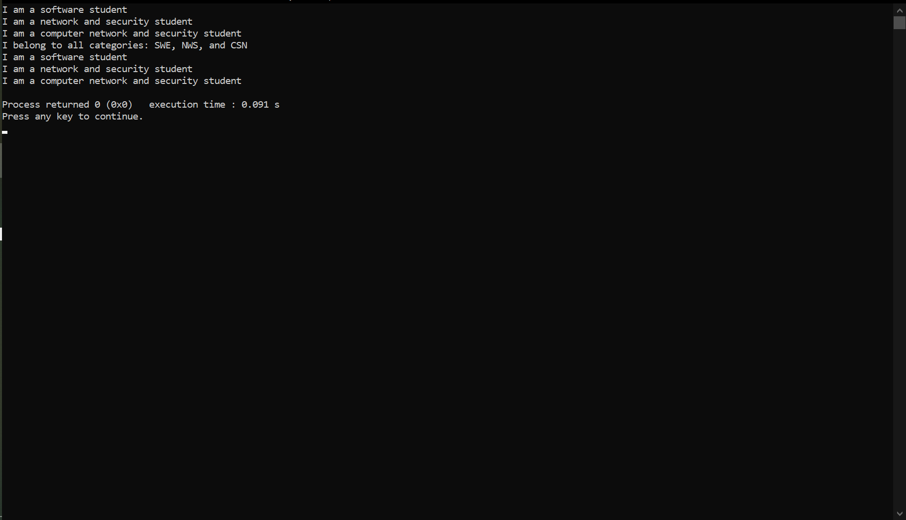

- [Key Features](#key-features)
- [💻 Getting Started](#getting-started)
  - [Setup](#setup)
  - [Prerequisites](#prerequisites)
  - [Install](#install)
  - [Usage](#usage)
  - [Output](#output)
- [👥 Authors](#authors)
- [🤝 Contributing](#contributing)
- [⭐️ Show your support](#support)
- [🙏 Acknowledgements](#acknowledgements)
- [📝 License](#license)

# 📖 Student Department: Desktop version<a name="about-project"></a>

This is the answer to the Object Oriented Programming section of the HND 2021 case study

**[Student Department]** is a C++ project

## 🛠 Built With <a name="built-with"></a>

### Tech Stack <a name="tech-stack"></a>

- C++

### Key Features <a name="key-features"></a>
- **Displays student's departments**

## 💻 Getting Started <a name="getting-started"></a>

To get a local copy up and running, follow these steps.

### Prerequisites

In order to run this project you need:

- Visual Studio Code with the ability to run C++ programs OR
- An IDE compatible with C++ programs

### Setup

Clone this repository to your desired folder:

```sh
  cd Stud-Dept
  git clone https://github.com/Anjoh-Samuel-Jr/Stud-Dept.git
```

### Install

Install this project with:

```sh
  cd Stud-Dept
  npm install
```

### Usage

To run the project, use the run command on the IDE you have available to you

### Output



## 👥 Authors <a name="authors"></a>

👤 **Anjoh Samuel Jr**

- GitHub: [Anjoh-Samuel-Jr](https://github.com/Anjoh-Samuel-Jr)
- LinkedIn: [Anjoh Samuel](https://www.linkedin.com/in/anjoh-samuel-341946302/)

## 🤝 Contributing <a name="contributing"></a>

Contributions, issues, and feature requests are welcome!

## ⭐️ Show your support <a name="support"></a>

If you like this project you can go ahead give a star to the repository.


## 🙏 Acknowledgments <a name="acknowledgements"></a>

I give thanks to ETSNTECH for investing in me. I am looking forth to building more projects

## 📝 License <a name="license"></a>

This project is [MIT](./MIT.md) licensed.
